# SERVER FOR REVERSE PROXY (Public)

- Memilih OS yang akan digunakan untuk server, dalam hal ini Ubuntu server 18.04

- Pilih spesifikasi server

- Pada configure instance details, matikan auto-assign ip

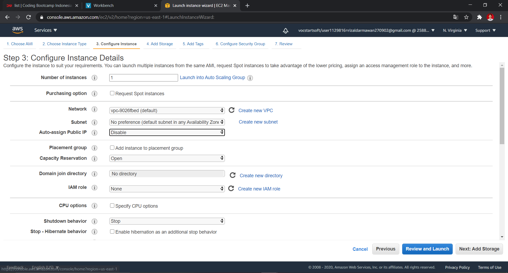

- Ubah ukuran default dari 8GB ke 10GB

- Pada configure security group tambahkan seperti gambar berikut

- Lalu review dan launch server, jangan lupa keypairnya karena akan dipakai untuk login

- Setelah itu allocate elastic ip agar ip publicnya statis

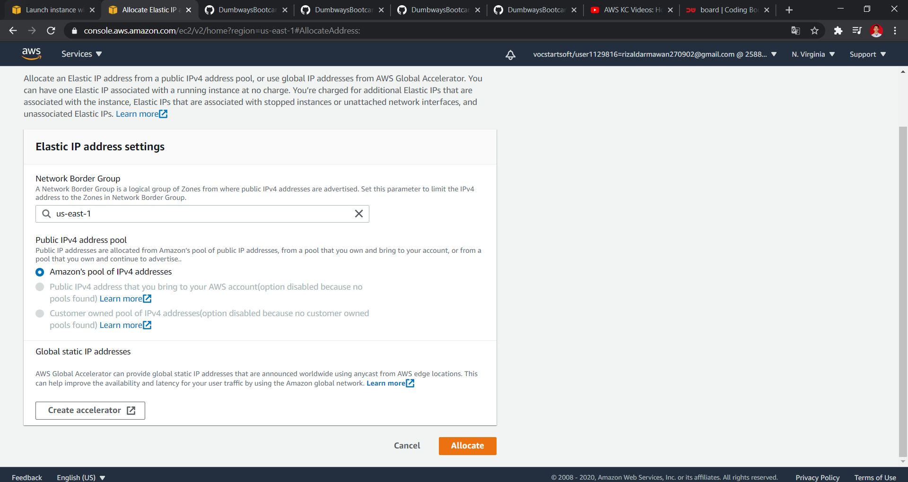

- Lalu Associate ipnya dengan instance

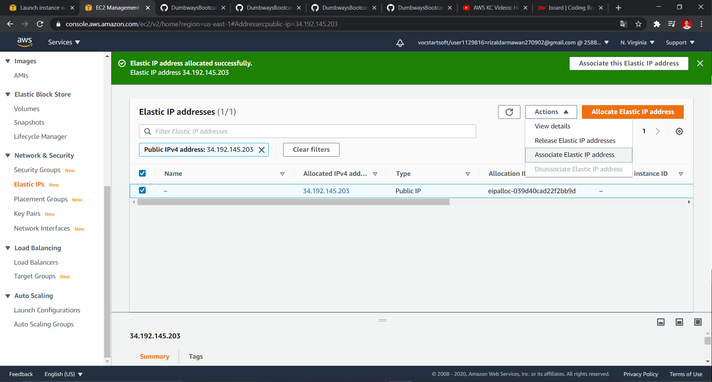

# SERVER FOR APPLICATION (Private)

- Untuk setingannya sama dengan sebelumnya, namun dibedakan pada configure security group, dan tidak diberi elastic ip

# SETTING USER, SSH, DAN HOSTNAME SERVER PUBLIC

- SSH Server Public dengan perintah `ssh -i keypair.pem ubuntu@ippublic`

- Tambahkan user dengan perintah `sudo adduser namauser`, lalu isi password sesuai keinginan

- Beri akses sudo untuk user baru tersebut dengan perintah `sudo usermod -G sudo namauser`

- Ubah hostname dengan mengedit `/etc/hosts` dan `/etc/hostname` dengan hostname yang diinginkan lalu restart server dan remote lagi

- Edit file `/etc/ssh/sshd_config` lalu rubah pada bagian `PasswordAuthentication no` menjadi `PasswordAuthentication yes`

- Restart service sshd dan cek servicenya, lalu coba remote kembali dengan `ssh namauser@publicip`

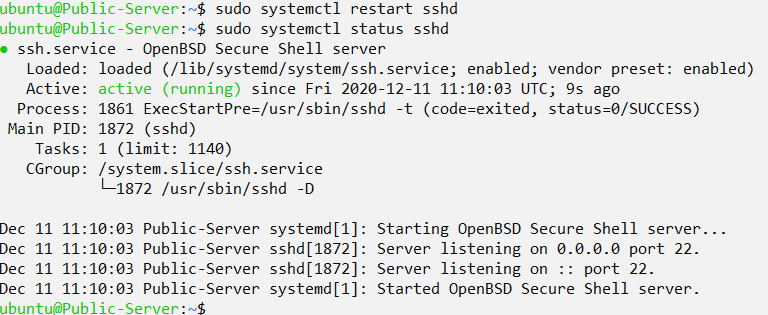

# SETTING USER, SSH, DAN HOSTNAME SERVER PRIVATE

- Pertama remote terlebih dahulu server public, baru setelah itu kita remote server private, sisanya sama dengan setting server public

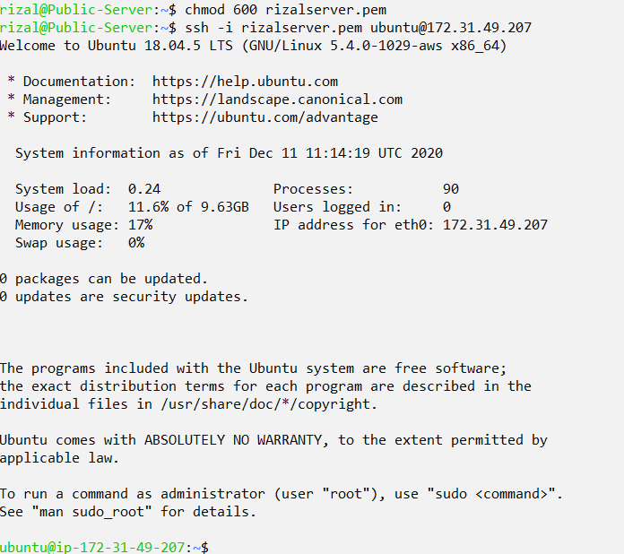

# SETTING VPC

- Karena saya menggunakan VPC Default, saya hanya akan memberi nama subnet pada server private menjadi private dan public
menjadi public

# SETTING NAT INSTANCE UNTUK SERVER PRIVATE

- Agar server private kita aman, kita tidak akan memberinya public ip yang dapat diakses langsung oleh internet, tetapi kita akan mengaksesnya lewat server public. tetapi, dengan ini server private kita tidak bisa mengakses internet, oleh karena itu kita akan setting nat instance agar private server dapat mengakses internet.

- Pertama kita bikin Instance baru, pilih AMI seperti gambar berikut

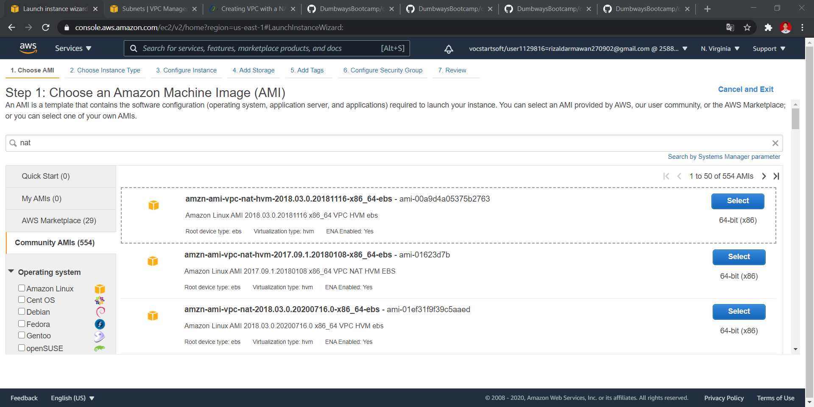

- Pilih saja spesifikasi yang ringan

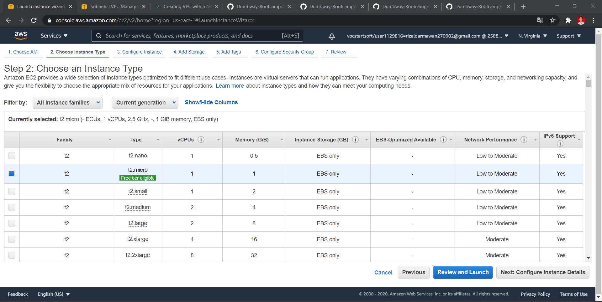

- Disini Pilih Network dengan VPC yang diinginkan, pada subnet pilih yang public, dan nyalakan auto assign ip

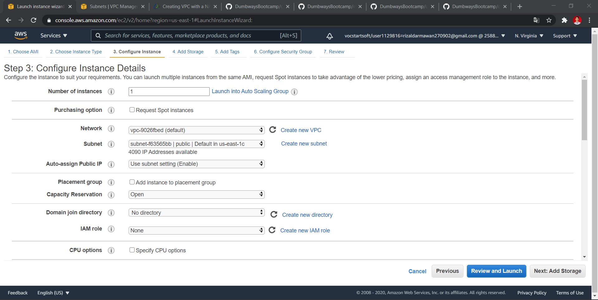

- Disini set dengan type all traffic, dan source ip dari network/subnet server private

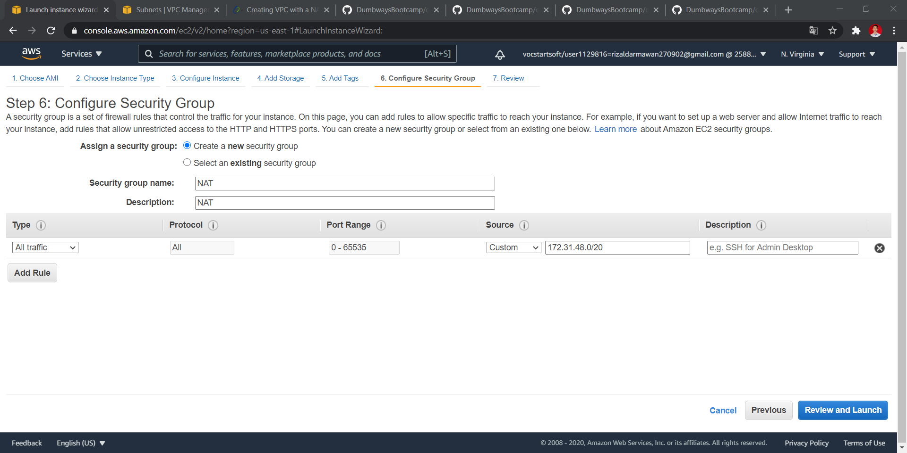

- Kita pindah ke list instance di aws, lalu pilih instance nat tadi dan klik action > networking > change source/destination check, dan ceklis stop

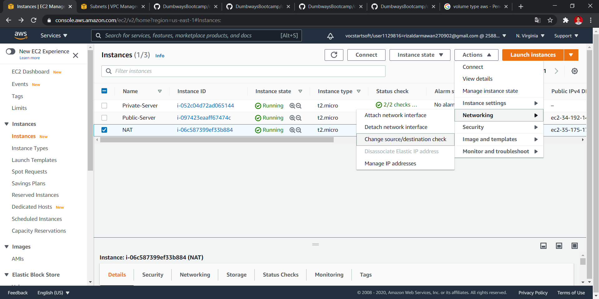
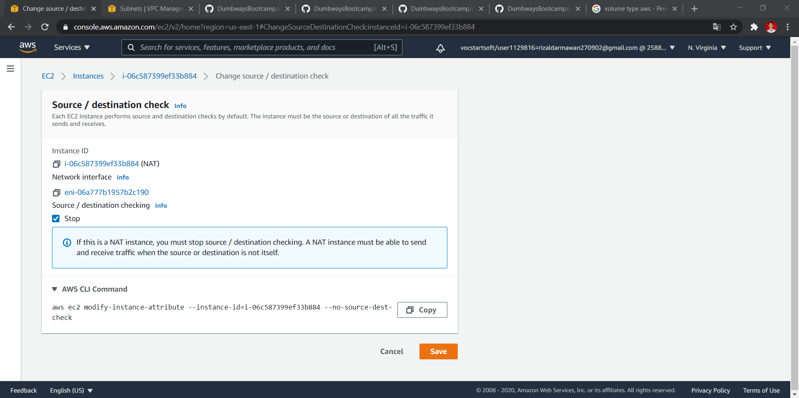

- Setelah itu kita bikin route table baru untuk server private

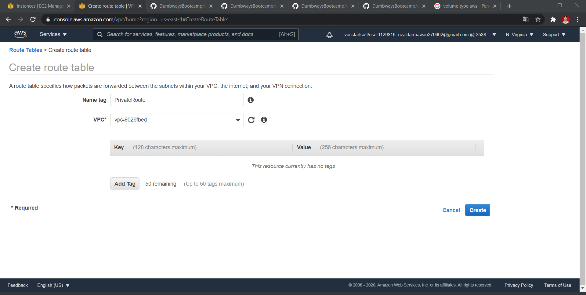

- Lalu edit routenya dan tambahkan Nat instancenya

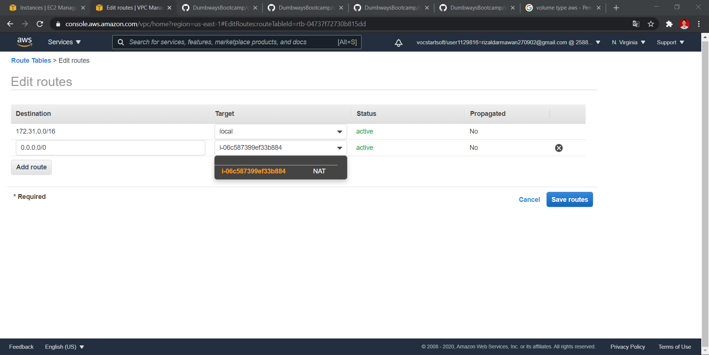

- Lalu associate route table tadi dengan subnet private

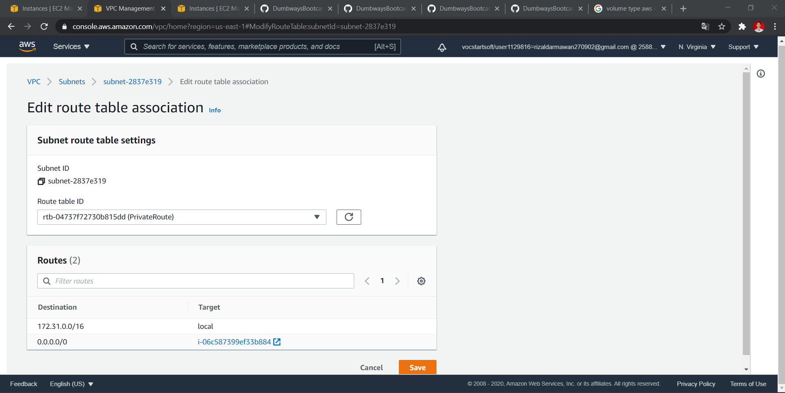

- Setelah itu cek koneksi private server

